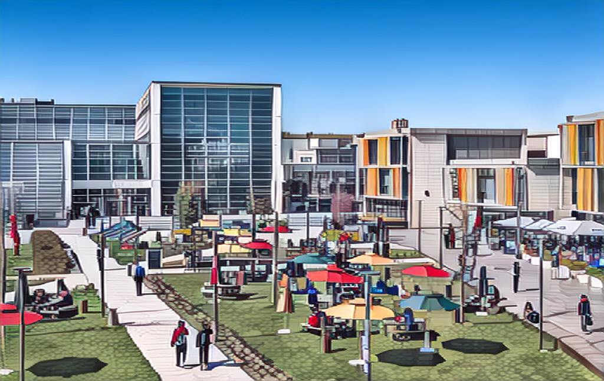
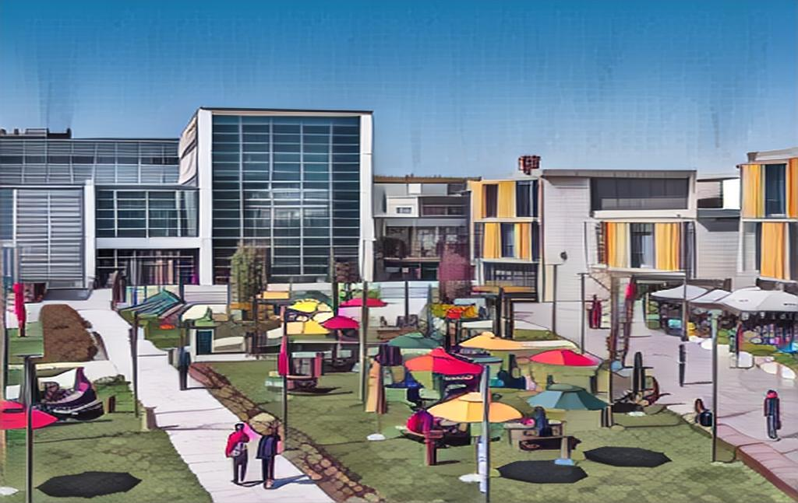
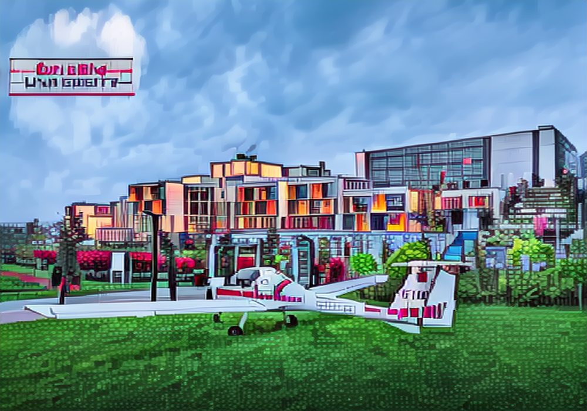
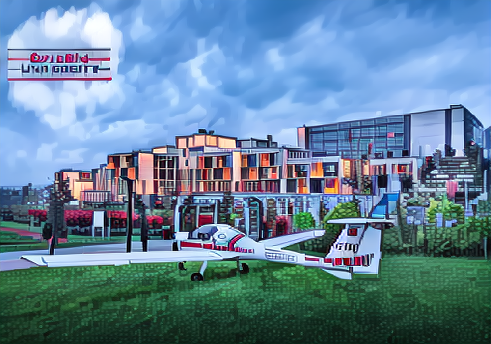

# GPA — GAN-made Pixel-Art Translation

> One-step, unpaired image-to-image translation that turns real landscape/architecture
> photographs into **pixel-art**, built on top of [img2img-turbo](https://github.com/GaParmar/img2img-turbo)
> (CycleGAN-Turbo) and extended with a custom **palette loss** to enforce the limited,
> quantized color palette that is characteristic of pixel art.
>
> Özyeğin University · Faculty of Engineering · CS402 Senior Project (2025 Spring)
> Authors: **Kaan Ümit İşmen**, **Emre Batuhan Yıldırım** · Supervisor: **Hasan Fehmi Ateş**

<p align="center">
  
  
</p>
<p align="center"><em>Left: real photo &nbsp;·&nbsp; Right: model output (real photo → pixel-art)</em></p>

---

## Table of Contents
- [Overview](#overview)
- [What's new in this fork](#whats-new-in-this-fork)
- [How it works](#how-it-works)
- [Repository structure](#repository-structure)
- [Installation](#installation)
- [Dataset](#dataset)
- [Training](#training)
- [Inference](#inference)
- [Results](#results)
- [Notebooks](#notebooks)
- [Notes & known limitations](#notes--known-limitations)
- [Acknowledgements](#acknowledgements)
- [References](#references)
- [License](#license)

---

## Overview

This is a graduation project that adapts **CycleGAN-Turbo** — a single-step diffusion
model for *unpaired* image-to-image translation — to a new domain pair:

```
domain A: real photographs (landscapes, buildings, scenes)
domain B: pixel-art images
```

Because the two domains are **unpaired** (we do not have a "photo ↔ pixel-art" image for
the same scene), the model is trained with the CycleGAN objective (adversarial + cycle-
consistency + identity losses) on top of the frozen [SD-Turbo](https://huggingface.co/stabilityai/sd-turbo)
backbone, where only small LoRA adapters, skip-connection convolutions and the first
conv layer are trainable.

The core research contribution of this project is an additional **palette loss** that
pushes generated images toward the small, discretized color palette that defines the
pixel-art aesthetic — something the vanilla CycleGAN-Turbo objective does not capture.

## What's new in this fork

Compared to the upstream [img2img-turbo](https://github.com/GaParmar/img2img-turbo):

| Addition | Where | Description |
|----------|-------|-------------|
| **Soft-histogram palette loss** | [`src/train_cyclegan_turbo_final.py`](src/train_cyclegan_turbo_final.py) | A differentiable, soft (Gaussian-binned) per-channel color histogram is computed for the cycle-reconstructed images and matched (L1) against the target-domain images. Encourages the generator to reproduce the target palette distribution. |
| **Quantization palette loss (variants)** | [`src/train_cyclegan_turbo.py`](src/train_cyclegan_turbo.py), [`src/modified_training.py`](src/modified_training.py) | Earlier experiments that quantize the generated/cycle images (`quantize_tensor`) and penalize the L1 distance to the quantized version, directly rewarding a reduced color count. |
| **New CLI args** | [`src/my_utils/training_utils.py`](src/my_utils/training_utils.py) | `--palette_loss {none,active}`, `--lambda_palette`, `--num_bins`, `--sigma`. |
| **Pixel-art dataset & prompts** | [`data/dataset_pixel_art/`](data/dataset_pixel_art) | Unpaired photo/pixel-art dataset with fixed prompts `"real photo of landscape"` (A) and `"pixel art"` (B). |

## How it works

**Base architecture (from CycleGAN-Turbo).** The generator wraps a single denoising step
of SD-Turbo. The VAE encoder/decoder forward passes are customized (`src/model.py`) to add
**skip connections** with learnable `skip_conv` layers and a `gamma` blend factor, so the
input scene structure is preserved while the style is translated. Two generators
(`a2b` and `b2a`) share the same SD-Turbo weights via deep-copied VAEs.

**Palette loss (this work).** For a batch of images `x` in `[0, 1]`, a differentiable
histogram is built by softly assigning each pixel to `num_bins` bin centers with a Gaussian
kernel of width `sigma`:

```python
# src/train_cyclegan_turbo_final.py
def soft_histogram(x, num_bins=16, min_val=0.0, max_val=1.0, sigma=0.01):
    bin_centers = torch.linspace(min_val, max_val, steps=num_bins, device=x.device)
    diff    = x.view(B, C, H * W, 1) - bin_centers      # soft binning
    weights = torch.exp(-0.5 * (diff / sigma) ** 2)
    hist    = weights.sum(dim=2)
    return hist / (hist.sum(dim=-1, keepdim=True) + 1e-6)

def palette_loss(fake_img, real_img, num_bins=16, sigma=0.01):
    return F.l1_loss(soft_histogram(fake_img, num_bins, sigma=sigma),
                     soft_histogram(real_img, num_bins, sigma=sigma))
```

The total generator loss is the standard CycleGAN-Turbo objective plus
`lambda_palette * palette_loss(...)`, applied to the cycle-reconstructed images so it is
fully differentiable through the generator.

## Repository structure

```
.
├── src/
│   ├── cyclegan_turbo.py            # CycleGAN-Turbo model (generator, VAE wrappers, ckpt I/O)
│   ├── pix2pix_turbo.py             # pix2pix-turbo model (paired; kept from upstream)
│   ├── model.py                     # SD-Turbo scheduler + customized VAE fwd w/ skip convs
│   ├── image_prep.py                # Canny edge helper (for the paired demo)
│   ├── inference_unpaired.py        # CLI inference for CycleGAN-Turbo (photo → pixel-art)
│   ├── inference_paired.py          # CLI inference for pix2pix-turbo
│   ├── train_cyclegan_turbo_final.py  # ⭐ main training script (soft-histogram palette loss)
│   ├── train_cyclegan_turbo.py      # experimental variant (quantization palette loss)
│   ├── modified_training.py         # experimental variant (quantization on cycle images)
│   ├── train_pix2pix_turbo.py       # paired training (from upstream)
│   └── my_utils/
│       ├── training_utils.py        # arg parsers, transforms, UnpairedDataset
│       └── dino_struct.py           # DINO-based structure loss utilities
├── data/dataset_pixel_art/          # unpaired dataset (train/test split + fixed prompts)
├── notebooks/                       # Colab notebooks used for training & experiments
├── gradio_canny2image.py            # Gradio demo (paired Canny→Image, from upstream)
├── assets/                          # README example images
├── requirements.txt
├── LICENSE
└── README.md
```

## Installation

Requires an **NVIDIA GPU with CUDA** — the model calls `.cuda()` directly and is not set up
for CPU-only inference.

```bash
git clone https://github.com/kaanismen/gan-pixel-art-translation.git
cd gan-pixel-art-translation

# (recommended) create an isolated environment
python -m venv venv
# Windows:  venv\Scripts\activate
# Linux/Mac: source venv/bin/activate

pip install -r requirements.txt
```

The SD-Turbo backbone (`stabilityai/sd-turbo`) is downloaded automatically from the
Hugging Face Hub on first run.

## Dataset

The model is trained on an **unpaired** dataset that follows the standard CycleGAN layout:

```
data/dataset_pixel_art/
├── fixed_prompt_a.txt     # "real photo of landscape"   (domain A caption)
├── fixed_prompt_b.txt     # "pixel art"                  (domain B caption)
├── train_A/   # real photos      (~4,300 images)   ← not tracked in git (size)
├── train_B/   # pixel-art images (~2,100 images)   ← not tracked in git (size)
├── test_A/    # held-out real photos      (committed)
└── test_B/    # held-out pixel-art images (committed)
```

The full training set (~6,500 images, ~780 MB) was assembled by the authors and is **not
committed** to keep the repository lightweight. Only the small `test_A` / `test_B` splits
and the prompt files are included so the expected structure is reproducible.

**Download the full dataset** (published as a GitHub Release asset):

```bash
# from the repo root
curl -L -o dataset_pixel_art.zip \
  https://github.com/kaanismen/gan-pixel-art-translation/releases/latest/download/dataset_pixel_art.zip
unzip -o dataset_pixel_art.zip -d data/
```

This restores `data/dataset_pixel_art/{train_A,train_B,test_A,test_B}`. Alternatively, drop
your own images into `train_A/` (photos) and `train_B/` (pixel-art) following the same layout.

## Training

The canonical script is **`src/train_cyclegan_turbo_final.py`** (soft-histogram palette loss).
This is the exact configuration used in the experiments (run from the repo root):

```bash
accelerate launch --num_processes 1 --num_machines 1 --mixed_precision fp16 --dynamo_backend no \
  src/train_cyclegan_turbo_final.py \
  --dataset_folder "data/dataset_pixel_art" \
  --train_img_prep "resize_128" \
  --val_img_prep   "no_resize" \
  --output_dir     "output/pixeltraining128" \
  --tracker_project_name "pixeltraining128" \
  --learning_rate 1e-5 \
  --max_train_steps 6000 \
  --train_batch_size 1 \
  --gradient_accumulation_steps 4 \
  --validation_steps 600 \
  --report_to "wandb" \
  --palette_loss "active" \
  --lambda_palette 0.0 \
  --lambda_gan 0.5 --lambda_idt 1 --lambda_cycle 1 \
  --gradient_checkpointing
```

Key arguments:

| Argument | Meaning |
|----------|---------|
| `--palette_loss {none,active}` | Enable/disable the palette loss term. |
| `--lambda_palette` | Weight of the palette loss in the total generator loss. Set `> 0` to actually affect training. |
| `--num_bins` | Number of histogram bins per color channel (default `16`). |
| `--sigma` | Gaussian width for soft binning (default `0.01`). |
| `--train_img_prep` | Training resolution/crop, e.g. `resize_128`, `resize_256`. |
| `--lambda_gan` / `--lambda_idt` / `--lambda_cycle` | Standard CycleGAN-Turbo loss weights. |

> **Tip:** `--lambda_palette 0.0` runs the model as a *baseline* (palette loss computed but
> not applied). Raise it (e.g. `0.5`–`5.0`) to see the palette effect, and compare against
> the baseline to ablate the contribution.

Checkpoints are written to `<output_dir>/checkpoints/model_<step>.pkl`.

## Inference

Translate a single photo into pixel-art with a trained checkpoint:

```bash
python src/inference_unpaired.py \
  --model_path "output/pixeltraining128/checkpoints/model_6000.pkl" \
  --input_image "data/dataset_pixel_art/test_A/00000001_(2).jpg" \
  --direction a2b \
  --prompt "pixel art" \
  --output_dir "outputs"
```

- `--direction a2b` → photo → pixel-art (use `b2a` for the reverse generator).
- `--prompt` is required for custom checkpoints (use the domain-B caption, `"pixel art"`).
- Add `--use_fp16` for faster inference.

The pretrained driving-scene models from the original paper (`day_to_night`,
`night_to_day`, `clear_to_rainy`, `rainy_to_clear`) are also available via `--model_name`.

## Results

Example outputs (campus / architecture scenes). The palette loss nudges outputs toward a
flatter, more quantized color distribution typical of pixel art:

<p align="center">
  
  
</p>
<p align="center"><em>Baseline (left) vs. palette-loss model (right), same input scene.</em></p>

> **Evaluation is qualitative.** Due to limited compute, every model was trained for a small
> budget (on the order of a few thousand iterations), and quantitative metrics such as FID
> were **not** computed. The images above are illustrative, not a benchmark — results
> improve with longer training, higher resolution and a larger `lambda_palette`. Reproduce
> and extend the comparison with your own runs.

## Notebooks

`notebooks/` contains the Google Colab notebooks used to run training and manage
experiment versions on Google Drive:

- `setup2.ipynb` — primary setup/training/inference notebook.
- `setup2_alt_version.ipynb` — an alternate version kept for reference.

They are exploratory and contain absolute Google Drive paths; treat them as a record of the
experiments rather than a clean entry point. The `src/*.py` scripts above are the canonical
way to run the project.

## Notes & known limitations

- **GPU required.** The code hard-codes CUDA; CPU inference is not supported as-is.
- **Canonical training script.** `train_cyclegan_turbo_final.py` is consistent with the
  current `my_utils/training_utils.py`. The earlier variants `train_cyclegan_turbo.py` and
  `modified_training.py` reference helpers/args (`quantize_tensor`, `image_edge`,
  `palette_loss_every`) that were patched live inside the Colab notebooks and are **not**
  present in this snapshot of `training_utils.py`. Use the final script unless you port
  those patches over.
- **`lambda_palette`.** The recorded run used `--lambda_palette 0.0` (baseline); set it
  `> 0` to apply the palette loss.
- The paired pix2pix-turbo code and the Gradio Canny→Image demo are kept from upstream and
  are not part of the pixel-art contribution.

## Acknowledgements

This project builds directly on:

- **[img2img-turbo](https://github.com/GaParmar/img2img-turbo)** by Gaurav Parmar et al. —
  the CycleGAN-Turbo / pix2pix-turbo implementation this repository forks and extends.
- **[SD-Turbo](https://huggingface.co/stabilityai/sd-turbo)** by Stability AI — the base
  one-step diffusion model.

## References

```bibtex
@article{parmar2024one,
  title   = {One-Step Image Translation with Text-to-Image Models},
  author  = {Parmar, Gaurav and Park, Taesung and Narasimhan, Srinivasa and Zhu, Jun-Yan},
  journal = {arXiv preprint arXiv:2403.12036},
  year    = {2024}
}
```

- Paper: [One-Step Image Translation with Text-to-Image Models](https://arxiv.org/abs/2403.12036)
- Upstream code: https://github.com/GaParmar/img2img-turbo

## License

Released under the [MIT License](LICENSE). This is a derivative work of img2img-turbo
(MIT) and uses SD-Turbo, which is governed by its
[own license](https://huggingface.co/stabilityai/sd-turbo/blob/main/LICENSE).
